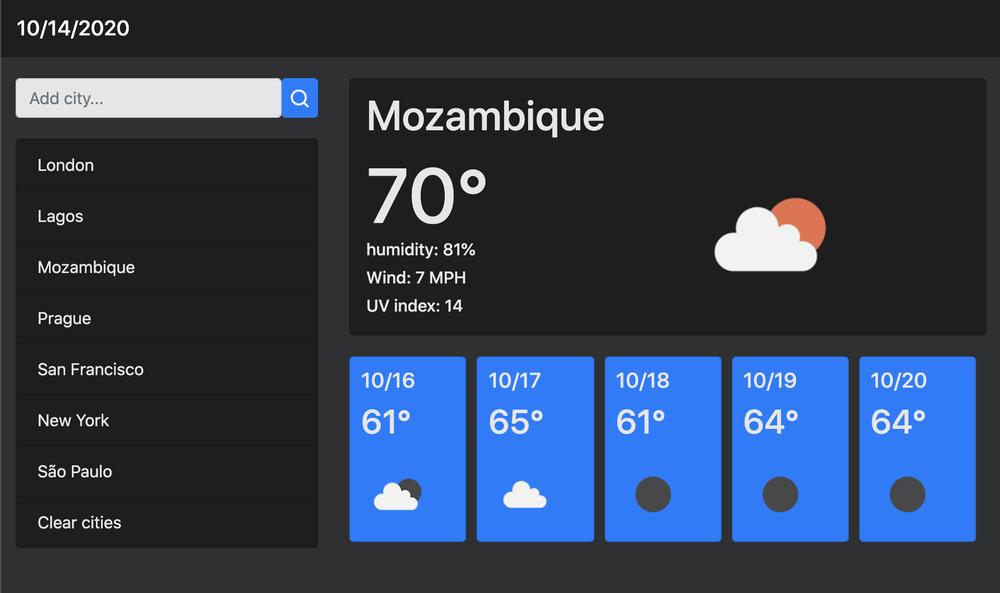

# weather-dashboard

As a global citizen, you want to view the latest weather reports from thousands of cities around the globe. This weather dashboard app delivers Open Weather Maps API data by city. Weather information is presented in a sleek, minimalist, and mobile first way.

## Usage

View the deployed [Weather Dashboard!](https://roccomaniscalco.github.io/weather-dashboard/)

### Features
* Enter new cities
* Clear cities
* Weather icons
* View current:
    * date
    * temperature
    * humidity
    * wind speed
    * UV index
* View 5-day forecast:
    * date
    * temperature
* Dark mode
* Mobile first
* Persistent searches

## Installation

1.  Visit the [weather-dashboard repository](https://github.com/roccomaniscalco/weather-dashboard)
2.  Click the green code button and select method of download
3.  Open the downloaded repository with your choice of IDE

## Credits

* Reference image provided by [Jonathon Watson](https://github.com/jonathanjwatson)
* CSS styling components provided by [Bootstrap](https://getbootstrap.com/)
* Search icon created with [Icon Scout](https://iconscout.com/)
* Weather information provided by [Open Weather Map](https://openweathermap.org/api) API
* [Jquery](https://jquery.com/) API
* [Moment.js](https://momentjs.com/) API

## License

Weather Dashboard license

Copyright (c) 2020 Rocco Maniscalco

Permission is hereby granted, free of charge, to any person obtaining a copy
of this software and associated documentation files (the "Software"), to deal
in the Software without restriction, including without limitation the rights
to use, copy, modify, merge, publish, distribute, sublicense, and/or sell
copies of the Software, and to permit persons to whom the Software is
furnished to do so, subject to the following conditions:

The above copyright notice and this permission notice shall be included in all
copies or substantial portions of the Software.

THE SOFTWARE IS PROVIDED "AS IS", WITHOUT WARRANTY OF ANY KIND, EXPRESS OR
IMPLIED, INCLUDING BUT NOT LIMITED TO THE WARRANTIES OF MERCHANTABILITY,
FITNESS FOR A PARTICULAR PURPOSE AND NONINFRINGEMENT. IN NO EVENT SHALL THE
AUTHORS OR COPYRIGHT HOLDERS BE LIABLE FOR ANY CLAIM, DAMAGES OR OTHER
LIABILITY, WHETHER IN AN ACTION OF CONTRACT, TORT OR OTHERWISE, ARISING FROM,
OUT OF OR IN CONNECTION WITH THE SOFTWARE OR THE USE OR OTHER DEALINGS IN THE
SOFTWARE.